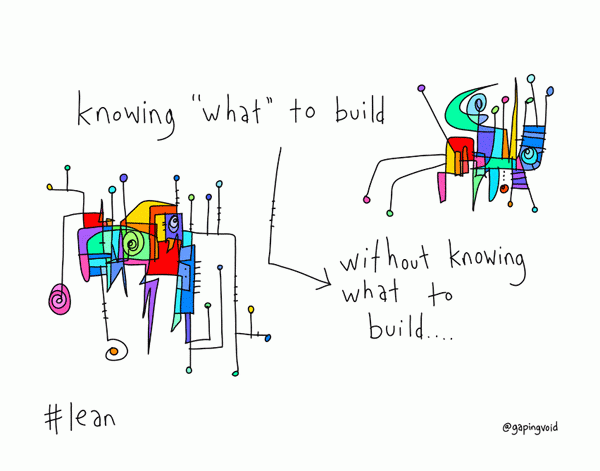
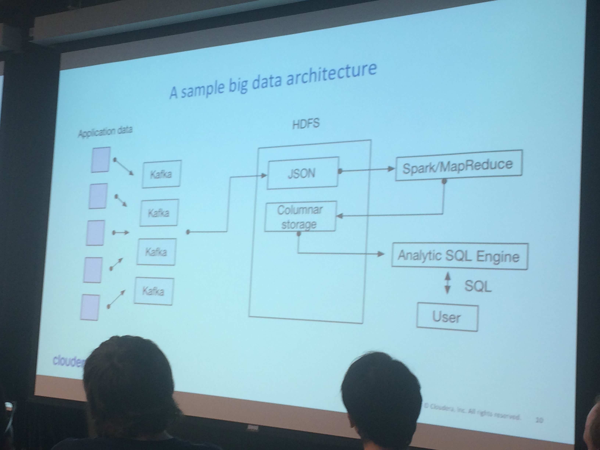
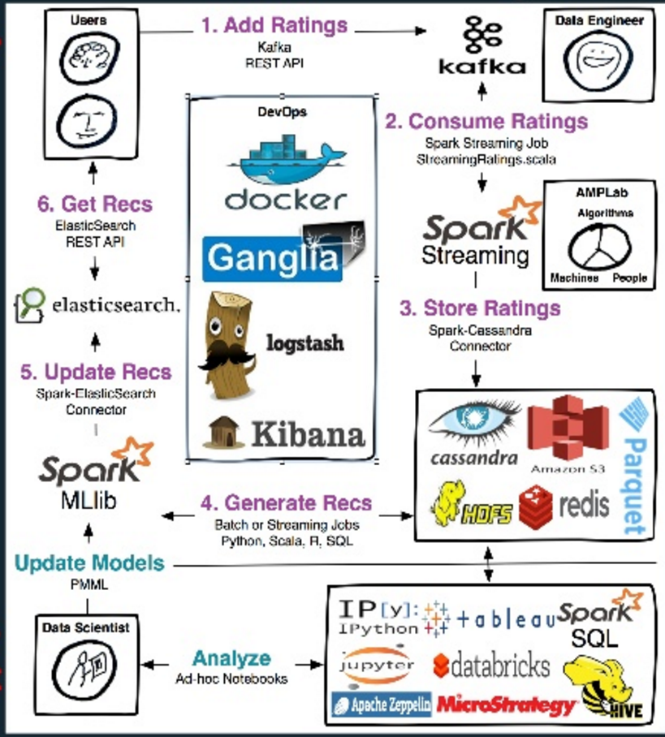
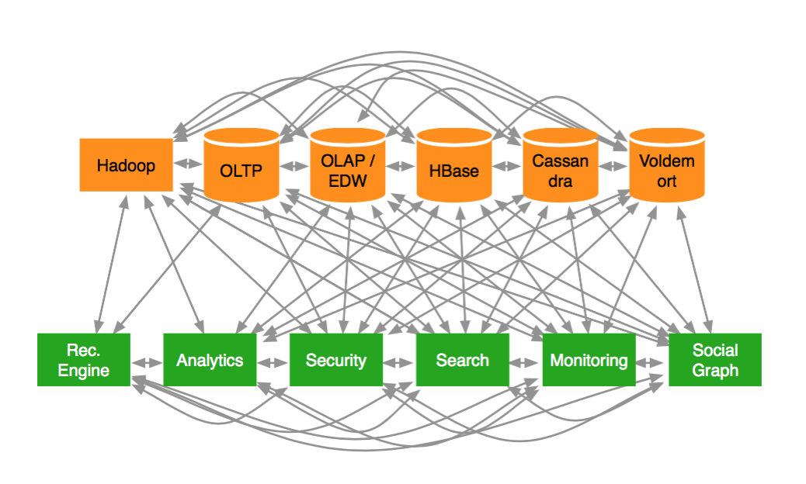

Useful Links
---

- https://xkcd.com/557/
- http://radar.oreilly.com/2015/09/three-best-practices-for-building-successful-data-pipelines.html
- [Project inspiration](http://tiffzhang.com/startup/)
- [Generate Startup Name](https://www.namemesh.com/company-name-generator)
- DDIA, Chapter 1 Reliable, Scalable and Maintainable Applications. Your system should address:
    - Reliability
    - Scalability
    - Maintainability
- If you have trouble coming up with an idea for product/company, ask, ["What is my mother no longer doing for me?”](http://www.vanityfair.com/news/2015/08/is-silicon-valley-in-another-bubble)

Consuming Streams
----
- Twitter
- [Mashape: Clearinghouse for API](https://market.mashape.com/explore?query=stream)
- https://www.quora.com/Where-can-I-find-public-or-free-real-time-or-streaming-data-sources
- http://stackoverflow.com/questions/4661755/json-or-any-up-to-date-weather-stream
- http://gacc.nifc.gov/

Making Streams
----
- Docker stream
    - https://www.npmjs.com/package/docker-stream
    - https://github.com/maxogden/docker-stream
        1. [install node](https://nodejs.org/en/) # install JavaScript runtime. i know we are getting very close to full stack dev!
        2. sudo npm install npm -g # update package manager for JavaScript
        2. sudo npm install docker-stream -g # install docker stream

Making fake data 😜
----
- https://www.mockaroo.com/
- https://pypi.python.org/pypi/fake-factory
- https://github.com/deepthawtz/faker

Architecture diagrams
---

- [Medium's Stack](https://medium.com/medium-eng/the-stack-that-helped-medium-drive-2-6-millennia-of-reading-time-e56801f7c492#.pmtld9o04)

Generic (but good)

\#AWESOME:

OKAY:

__FAIL__:

[A deep dive through the evolution of the if(we) data science architecture.](https://www.oreilly.com/learning/architecting-for-data-science)