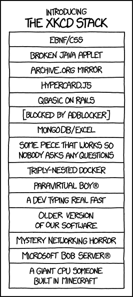

Data Engineering Final Project
===

This is a cumulation and display of what you have learned during Data Engineering. The goal is a working and documented system that will become part your Data Science public portfolio. This rubric is designed to guide you but is intentionally vague to allow for interpretation and creativity.

---
Problem Statement
---

You have just be hired as technical cofounder of a pre-seed stage startup. You are in-charge of designing and building a data system. The data system must serve customer needs, empower your (soon-to-hired) team, and attract funding. But 1st you need to pick your product!

Here are some ideas:

  
Uber for kittens  

or 

  
[Here comes the airplane: food-delivery-as-a-service](https://www.herecomestheairplane.co/) They say the last mile is the hardest 😉

---
Requirements
---

### Data

You must ingest from, at a least one, streaming data source. Either create your streaming source via VM or find a 'firehose'. You must have at two different dataformats types (e.g., tabular, images, graph, ...) that interact (i.e., join).

You can either use existing dataset (e.g., [AWS public datasets](https://aws.amazon.com/public-data-sets/)) or you can make up your data (e.g., whenever I make up data 😉 I use Python's Faker or fake-factory).

### Architecture

You must solve user's real problems, internal and external. To solve these problems, you must use at 3 technologies from the class. You must use 1 NoSQL database. Ideally you would use a Lambda Architecture, with a batch and speed layer.

You have to create a 'spec' and architecture diagram. The [3Vs](http://www.datasciencecentral.com/forum/topics/the-3vs-that-define-big-data) is a good place start. How many users? How much data are they generate per second or per day? How do the user use their data (if at all)?

How do to enable people at your company? What are the analytics patterns? Monthly reports? Outage reports? How long can your system go down? What do product managers need to know? What does a CEO dashboard look like?

