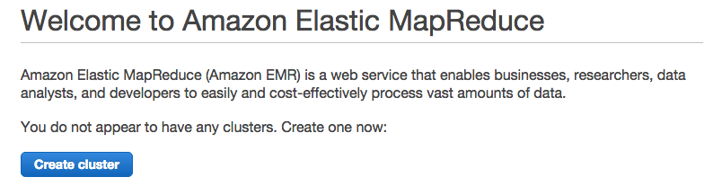
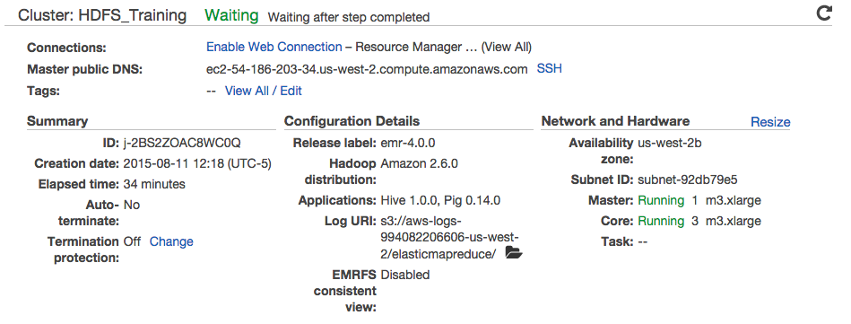

# HDFS Lab 1

HDFS Lab 1 consists of the following tasks:

- [Set up 4-node HDFS cluster on EMR](#Setup)
- [HDFS Load Data and Run WordCount](#LoadData)
- [Basic HDFS Usage Using EMR](#BasicUsage)
- [Running Applications using Hortonworks Sandbox](#Application)

## Set up 4-node HDFS cluster on EMR

The first lab will be to create a 4-node cluster on Amazon's Elastic MapReduce
environment. This assumes that you have already created an account with Amazon
Web Services (http://aws.amazon.com/)

### Amazon Key Pairs

After logging into AWS, you need to create a key pair to log into the cluster.
If you already have an existing key pair, you can use that. Otherwise, follow
the instructions below:

For this lab exercise, create a key pair with the name `emr_training` as shown
below:

After clicking **Create**, the key pair will be downloaded in your browser
(either automatically or you will be prompted, depending on your browser) as
shown below:

Save this file as you will need it for the lab exercises to follow.
You will need to change the permissions on the `emr_training.pem` file for
security reasons before you can connect

    # chmod 600 emr_training.pem
    # ls -l emr_training.pem
    -rw-------@ 1 lindsay  staff  1692 Aug 11 10:40 emr_training.pem

### Create EMR Cluster

Go to the main AWS page, click on the **EMR** item under the **Analytics**
section as shown below:

The next step is to create an Elastic MapReduce cluster by clicking on **Create
cluster**.

On the **Quick cluster configuration** screen enter the following:

Item                 |Value
----                 |-----
Cluster name         |`HDFS_Training`
Applications         |Core Hadoop: Hadoop 2.7.1 with Ganglia 3.7.2, Hive 1.0.0, and Pig 0.14.0
Number of Instances  |`4`
EC2 key pair         |`emr_training` (or a key you have previously created)

Press **Create cluster** to continue

The screen will refresh periodically as the cluster is being built.

While you are waiting (this may take 10 minutes or more), go back to the AWS console and launch
the EC2 dashboard.  In the **Network & Security** section click on the link for **Security Groups**.
You will see that the EMR cluster wizard has created new security groups with firewall rules for
both the master and slave nodes.  Select the group for the master node and click on the **Inbound**
tab in the bottom area.

Click the **Edit** button and a dialog named **Edit inbound rules** will be displayed.  Click the
button labeled **Add Rule** and you will see that a new rule has been added to the list.  Change
the type of this rule to 'SSH'.  Change the **Source** field to 'Anywhere'.  This new rule allows
the master node to be accessed with the SSH protocol from any computer on the Internet.  Usually
you would impose stricter access controls but we will allow it for this lab.  Click the **Save**
button to enforce the new rules for the security group.

Once the cluster has been built, you should be able to ssh into the cluster.
Click on the **SSH** link beside **Master public DNS:** as shown below:

A screen will appear providing the details on how to connect to the cluster:

Copy the *ssh* line as follows:

    ssh hadoop@ec2-54-186-203-34.us-west-2.compute.amazonaws.com -i emr_training.pem

***Note:*** this assumes the `emr_training.pem` file has been saved into your
home directory. Adjust this to where you have saved the file.

    $ ssh hadoop@ec2-54-186-203-34.us-west-2.compute.amazonaws.com -i emr_training.pem
    Last login: Tue Aug 11 18:01:49 2015

           __|  __|_  )
           _|  (     /   Amazon Linux AMI
          ___|\___|___|

    https://aws.amazon.com/amazon-linux-ami/2015.03-release-notes/
    14 package(s) needed for security, out of 26 available
    Run "sudo yum update" to apply all updates.

    EEEEEEEEEEEEEEEEEEEE MMMMMMMM           MMMMMMMM RRRRRRRRRRRRRRR
    E::::::::::::::::::E M:::::::M         M:::::::M R::::::::::::::R
    EE:::::EEEEEEEEE:::E M::::::::M       M::::::::M R:::::RRRRRR:::::R
      E::::E       EEEEE M:::::::::M     M:::::::::M RR::::R      R::::R
      E::::E             M::::::M:::M   M:::M::::::M   R:::R      R::::R
      E:::::EEEEEEEEEE   M:::::M M:::M M:::M M:::::M   R:::RRRRRR:::::R
      E::::::::::::::E   M:::::M  M:::M:::M  M:::::M   R:::::::::::RR
      E:::::EEEEEEEEEE   M:::::M   M:::::M   M:::::M   R:::RRRRRR::::R
      E::::E             M:::::M    M:::M    M:::::M   R:::R      R::::R
      E::::E       EEEEE M:::::M     MMM     M:::::M   R:::R      R::::R
    EE:::::EEEEEEEE::::E M:::::M             M:::::M   R:::R      R::::R
    E::::::::::::::::::E M:::::M             M:::::M RR::::R      R::::R
    EEEEEEEEEEEEEEEEEEEE MMMMMMM             MMMMMMM RRRRRRR      RRRRRR

    [hadoop@ip-172-31-18-92 ~]$

You have now successfully connected to your EMR cluster.

We can test that we can list the files in the HDFS filesystem as follows:

    [hadoop@ip-172-31-18-92 ~]$ hadoop fs -ls /
    Found 4 items
    drwxr-xr-x   - hadoop hadoop          0 2015-08-11 17:22 /mnt
    drwxrwxrwt   - hdfs   hadoop          0 2015-08-11 17:23 /tmp
    drwxr-xr-x   - hdfs   hadoop          0 2015-08-11 17:22 /user
    drwxr-xr-x   - hdfs   hadoop          0 2015-08-11 17:22 /var
    [hadoop@ip-172-31-18-92 ~]$

## HDFS Load Data and Run WordCount

- Create directories
- Upload sample file
- Run WordCount on const.txt
- Use distcp to copy directories from S3 to HDFS
- Terminate EMR Cluster

### Create directories

First we are going to create a directory in HDFS to upload our movie lens file.
Login to the cluster and run the following:

    [hadoop@ip-172-31-18-92 ~]$ hadoop fs -mkdir -p /data/movielens

This will create the parent directory */data* using the **-p** option.
We can make sure the directory path has been created as follows:

    [hadoop@ip-172-31-18-92 ~]$ hadoop fs -ls -R /data
    drwxr-xr-x   - hadoop hadoop          0 2015-08-11 18:14 /data/movielens

### Upload sample file

We will download some sample data to run a WordCount test against this. We will
download the U.S. Constitution text as the sample file to use.

    [hadoop@ip-172-31-18-92 ~]$ wget https://www.usconstitution.net/const.txt
    Resolving www.usconstitution.net (www.usconstitution.net)... 162.159.250.165,
    162.159.249.165
    Connecting to www.usconstitution.net
    (www.usconstitution.net)|162.159.250.165|:443... connected.
    HTTP request sent, awaiting response... 200 OK
    Length: unspecified [text/plain]
    Saving to: ‘const.txt’

    const.txt               [ <=>                  ]  44.06K  --.-KB/s   in 0.02s

    2015-08-11 20:25:53 (2.62 MB/s) - ‘const.txt’ saved [45119]

    [hadoop@ip-172-31-18-92 ~]$ ls -l
    total 516
    drwxr-xr-x 2 hadoop hadoop   4096 Aug 11 17:32 emcharts
    -rw-rw-r-- 1 hadoop hadoop 45119 Aug 12  2013 const.txt

    [hadoop@ip-172-31-18-92 ~]$ hadoop fs -put const.txt /data/movielens
    [hadoop@ip-172-31-18-92 ~]$ hadoop fs -ls /data/movielens
    Found 1 items
    -rw-r--r--   1 hadoop hadoop      45119 2015-08-11 20:26
    /data/movielens/const.txt

### Run WordCount on const.txt

Next we will run WordCount on the const.txt file which has the following format:

    [hadoop@ip-172-31-18-92 ~] more const.txt
    Provided by USConstitution.net

    [Note: Repealed text is not noted in this version.  Spelling errors have been
    corrected in this version.  For an uncorrected, annotated version of the
    Constitution, visit http://www.usconstitution.net/const.html ]

    We the People of the United States, in Order to form a more perfect Union,
    establish Justice, insure domestic Tranquility, provide for the common
    defence, promote the general Welfare, and secure the Blessings of Liberty to
    ourselves and our Posterity, do ordain and establish this Constitution for the
    United States of America.

We will run the WordCount mapreduce job against this file to count the number of
instances of each word found in the file.

We will run out first mapreduce job against the cluster using the following
command:
`hadoop jar /usr/lib/hadoop-mapreduce/hadoop-mapreduce-examples.jar wordcount
/data/movielens/const.txt wordcount_output`

    [hadoop@ip-172-31-18-92 hadoop-mapreduce]$ hadoop jar /usr/lib/hadoop-mapreduce
    /hadoop-mapreduce-examples.jar wordcount /data/movielens/const.txt
    wordcount_output
    15/08/11 20:29:44 INFO client.RMProxy: Connecting to ResourceManager at
    ip-172-31-18-92.us-west-2.compute.internal/172.31.18.92:8032
    15/08/11 20:29:45 INFO metrics.MetricsSaver: MetricsConfigRecord
    disabledInCluster: false instanceEngineCycleSec: 60 clusterEngineCycleSec: 60
    disableClusterEngine: false maxMemoryMb: 3072 maxInstanceCount: 500
    lastModified: 1439313752099
    15/08/11 20:29:45 INFO metrics.MetricsSaver: Created MetricsSaver
    j-2BS2ZOAC8WC0Q:i-fe815b38:RunJar:20394 period:60
    /mnt/var/em/raw/i-fe815b38_20150811_RunJar_20394_raw.bin
    15/08/11 20:29:45 INFO input.FileInputFormat: Total input paths to process : 1
    15/08/11 20:29:45 INFO lzo.GPLNativeCodeLoader: Loaded native gpl library
    15/08/11 20:29:45 INFO lzo.LzoCodec: Successfully loaded & initialized native-
    lzo library [hadoop-lzo rev f6f39de0c0bc9982f67f24a5728ab3f2515eadb8]
    15/08/11 20:29:45 INFO mapreduce.JobSubmitter: number of splits:1
    15/08/11 20:29:45 INFO mapreduce.JobSubmitter: Submitting tokens for job:
    job_1439313745141_0002
    15/08/11 20:29:46 INFO impl.YarnClientImpl: Submitted application
    application_1439313745141_0002
    15/08/11 20:29:46 INFO mapreduce.Job: The url to track the job:
    http://ip-172-31-18-92.us-
    west-2.compute.internal:20888/proxy/application_1439313745141_0002/
    15/08/11 20:29:46 INFO mapreduce.Job: Running job: job_1439313745141_0002
    15/08/11 20:29:53 INFO mapreduce.Job: Job job_1439313745141_0002 running in uber
    mode : false
    15/08/11 20:29:53 INFO mapreduce.Job:  map 0% reduce 0%
    15/08/11 20:29:59 INFO mapreduce.Job:  map 100% reduce 0%
    15/08/11 20:30:06 INFO mapreduce.Job:  map 100% reduce 9%
    15/08/11 20:30:07 INFO mapreduce.Job:  map 100% reduce 36%
    15/08/11 20:30:09 INFO mapreduce.Job:  map 100% reduce 64%
    15/08/11 20:30:10 INFO mapreduce.Job:  map 100% reduce 73%
    15/08/11 20:30:11 INFO mapreduce.Job:  map 100% reduce 82%
    15/08/11 20:30:13 INFO mapreduce.Job:  map 100% reduce 100%
    15/08/11 20:30:13 INFO mapreduce.Job: Job job_1439313745141_0002 completed
    successfully
    15/08/11 20:30:13 INFO mapreduce.Job: Counters: 49
            File System Counters
                    FILE: Number of bytes read=18270
                    FILE: Number of bytes written=1375064
                    FILE: Number of read operations=0
                    FILE: Number of large read operations=0
                    FILE: Number of write operations=0
                    HDFS: Number of bytes read=45263
                    HDFS: Number of bytes written=17261
                    HDFS: Number of read operations=36
                    HDFS: Number of large read operations=0
                    HDFS: Number of write operations=22
            Job Counters
                    Launched map tasks=1
                    Launched reduce tasks=11
                    Rack-local map tasks=1
                    Total time spent by all maps in occupied slots (ms)=26442
                    Total time spent by all reduces in occupied slots (ms)=690036
                    Total time spent by all map tasks (ms)=4407
                    Total time spent by all reduce tasks (ms)=57503
                    Total vcore-seconds taken by all map tasks=4407
                    Total vcore-seconds taken by all reduce tasks=57503
                    Total megabyte-seconds taken by all map tasks=6346080
                    Total megabyte-seconds taken by all reduce tasks=165608640
            Map-Reduce Framework
                    Map input records=872
                    Map output records=7652
                    Map output bytes=75556
                    Map output materialized bytes=18226
                    Input split bytes=144
                    Combine input records=7652
                    Combine output records=1697
                    Reduce input groups=1697
                    Reduce shuffle bytes=18226
                    Reduce input records=1697
                    Reduce output records=1697
                    Spilled Records=3394
                    Shuffled Maps =11
                    Failed Shuffles=0
                    Merged Map outputs=11
                    GC time elapsed (ms)=385
                    CPU time spent (ms)=11680
                    Physical memory (bytes) snapshot=2829729792
                    Virtual memory (bytes) snapshot=36023717888
                    Total committed heap usage (bytes)=3796369408
            Shuffle Errors
                    BAD_ID=0
                    CONNECTION=0
                    IO_ERROR=0
                    WRONG_LENGTH=0
                    WRONG_MAP=0
                    WRONG_REDUCE=0
            File Input Format Counters
                    Bytes Read=45119
            File Output Format Counters
                    Bytes Written=17261

The output of the job has been created in the HDFS directory `wordcount_output`
we specified in our home directory on HDFS.

    [hadoop@ip-172-31-18-92 hadoop-mapreduce]$ hadoop fs -ls wordcount_output
    Found 12 items
    -rw-r--r--   1 hadoop hadoop          0 2015-08-11 20:30
    wordcount_output/_SUCCESS
    -rw-r--r--   1 hadoop hadoop       1614 2015-08-11 20:30
    wordcount_output/part-r-00000
    -rw-r--r--   1 hadoop hadoop       1635 2015-08-11 20:30
    wordcount_output/part-r-00001
    -rw-r--r--   1 hadoop hadoop       1581 2015-08-11 20:30
    wordcount_output/part-r-00002
    -rw-r--r--   1 hadoop hadoop       1690 2015-08-11 20:30
    wordcount_output/part-r-00003
    -rw-r--r--   1 hadoop hadoop       1429 2015-08-11 20:30
    wordcount_output/part-r-00004
    -rw-r--r--   1 hadoop hadoop       1411 2015-08-11 20:30
    wordcount_output/part-r-00005
    -rw-r--r--   1 hadoop hadoop       1442 2015-08-11 20:30
    wordcount_output/part-r-00006
    -rw-r--r--   1 hadoop hadoop       1772 2015-08-11 20:30
    wordcount_output/part-r-00007
    -rw-r--r--   1 hadoop hadoop       1594 2015-08-11 20:30
    wordcount_output/part-r-00008
    -rw-r--r--   1 hadoop hadoop       1743 2015-08-11 20:30
    wordcount_output/part-r-00009
    -rw-r--r--   1 hadoop hadoop       1350 2015-08-11 20:30
    wordcount_output/part-r-00010

If we look at the first file, we can see the results of the wordcount job:

    [hadoop@ip-172-31-18-92 ~]$ hadoop fs -cat wordcount_output/part-r-00000
    (or     1
    12      1
    24      1
    9       2
    Adjournment     1
    America 1
    And     6
    Arts,   1
    Blount, 1
    Carroll 1
    Cases,  2
    Chief   2
    Coin    2
    Coin,   1
    Commander       1
    Concurrence     3
    Consequence     3

### Use distcp to copy directories from S3 to HDFS

#### Download the dataset 'Movielens Latest'

- URL [http://grouplens.org/datasets/movielens/](http://grouplens.org/datasets/m
ovielens/)

#### Upload the file to S3

- Follow the instructions under 'Create and Configure an Amazon S3
  Bucket' at this URL:
  http://docs.aws.amazon.com/ElasticMapReduce/latest/DeveloperGuide/emr-
  plan-upload-s3.html

- Click your new bucket and upload the Movielens zip-file

#### Copy file from S3 to HDFS using distcp

Use the DistCp tool to copy the MovieLens file from S3 to HDFS. For more info on
DistCp, see below.

    hadoop distcp s3n://deistudent/ml-latest.zip  /training

Replace the <deistudent> entry above with your S3 bucket name.

#### A note on distcp:

"The distcp tool is useful for quickly prepping S3 for MapReduce jobs that use
S3 for input or for backing up the content of hdfs."

Apache DistCp is an open-source tool you can use to copy large amounts of data.
DistCp uses MapReduce to copy in a distributed manner
S3DistCp is an extension of DistCp that is optimized to work with AWS,
particularly Amazon S3.
More info: http://wiki.apache.org/hadoop/AmazonS3

### Terminate EMR Cluster

After completing this exercise, go into Amazon AWS and click on **Terminate** to
remove the cluster we have just built.
