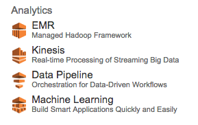
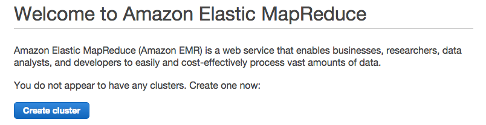
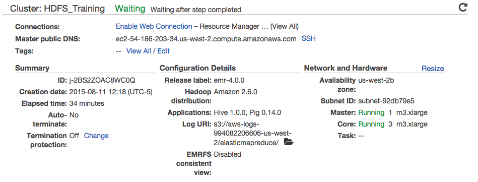
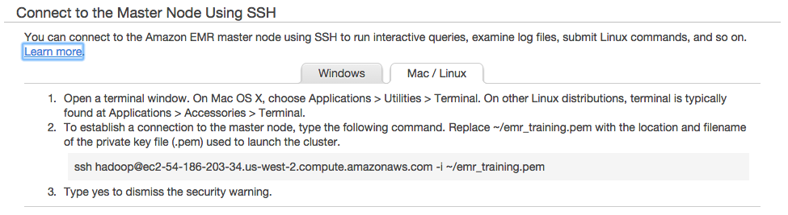

# HDFS Lab 1

HDFS Lab 1 consists of the following tasks:

- [Set up 4-node HDFS cluster on EMR](#Setup)
- [HDFS Load Data and Run WordCount](#LoadData)
- [Running Applications using Hortonworks Sandbox](#Application)

## Set up 4-node HDFS cluster on EMR

The first lab will be to create a 4-node cluster on Amazon's Elastic MapReduce
environment. This assumes that you have already created an account with Amazon
Web Services (http://aws.amazon.com/)

### Amazon Key Pairs

After logging into AWS, you need to create a key pair (a `pem` file)
to log into the cluster. 

**NOTE:** Use your `pem` file name instead of `emr_training` as you
follow this lab.

### Create EMR Cluster

Go to the main AWS console page, click on the **EMR** item under the **Analytics**
section as shown below:

The next step is to create an Elastic MapReduce cluster by clicking on **Create
cluster**.

On the **Quick cluster configuration** screen enter the following:

Item                 |Value
----                 |-----
Cluster name         |`HDFS_Training`
Applications         |Core Hadoop: Hadoop 2.7.1 with Ganglia 3.7.2, Hive 1.0.0, and Pig 0.14.0
Number of Instances  |`4`
EC2 key pair         |`emr_training` (or a key you have previously created)

Press **Create cluster** to continue

The screen will refresh periodically as the cluster is being built.

While you are waiting (this may take 10 minutes or more), go back to the AWS console and launch
the EC2 dashboard.  In the **Network & Security** section click on the link for **Security Groups**.
You will see that the EMR cluster wizard has created new security groups with firewall rules for
both the master and slave nodes.  Select the group for the master node and click on the **Inbound**
tab in the bottom area.

Click the **Edit** button and a dialog named **Edit inbound rules** will be displayed.  Click the
button labeled **Add Rule** and you will see that a new rule has been added to the list.  Change
the type of this rule to 'SSH'.  Change the **Source** field to 'Anywhere'.  This new rule allows
the master node to be accessed with the SSH protocol from any computer on the Internet.  Usually
you would impose stricter access controls but we will allow it for this lab.  Click the **Save**
button to enforce the new rules for the security group.

Once the cluster has been built, you should be able to ssh into the cluster.
Click on the **SSH** link beside **Master public DNS:** as shown below:

A screen will appear providing the details on how to connect to the cluster:

Copy the *ssh* line as follows:

    ssh hadoop@ec2-54-186-203-34.us-west-2.compute.amazonaws.com -i emr_training.pem

***NOTE:*** Replace the path to `emr_training.pem` with the path to your `pem` file.

Here is the output you should see.

    $ ssh hadoop@ec2-54-186-203-34.us-west-2.compute.amazonaws.com -i emr_training.pem
    Last login: Tue Aug 11 18:01:49 2015

           __|  __|_  )
           _|  (     /   Amazon Linux AMI
          ___|\___|___|

    https://aws.amazon.com/amazon-linux-ami/2015.03-release-notes/
    14 package(s) needed for security, out of 26 available
    Run "sudo yum update" to apply all updates.

    EEEEEEEEEEEEEEEEEEEE MMMMMMMM           MMMMMMMM RRRRRRRRRRRRRRR
    E::::::::::::::::::E M:::::::M         M:::::::M R::::::::::::::R
    EE:::::EEEEEEEEE:::E M::::::::M       M::::::::M R:::::RRRRRR:::::R
      E::::E       EEEEE M:::::::::M     M:::::::::M RR::::R      R::::R
      E::::E             M::::::M:::M   M:::M::::::M   R:::R      R::::R
      E:::::EEEEEEEEEE   M:::::M M:::M M:::M M:::::M   R:::RRRRRR:::::R
      E::::::::::::::E   M:::::M  M:::M:::M  M:::::M   R:::::::::::RR
      E:::::EEEEEEEEEE   M:::::M   M:::::M   M:::::M   R:::RRRRRR::::R
      E::::E             M:::::M    M:::M    M:::::M   R:::R      R::::R
      E::::E       EEEEE M:::::M     MMM     M:::::M   R:::R      R::::R
    EE:::::EEEEEEEE::::E M:::::M             M:::::M   R:::R      R::::R
    E::::::::::::::::::E M:::::M             M:::::M RR::::R      R::::R
    EEEEEEEEEEEEEEEEEEEE MMMMMMM             MMMMMMM RRRRRRR      RRRRRR

    [hadoop@ip-172-31-18-92 ~]$

You have now successfully connected to your EMR cluster.

We can test that we can list the files in the HDFS filesystem as follows:

    [hadoop@ip-172-31-18-92 ~]$ hadoop fs -ls /
    Found 4 items
    drwxr-xr-x   - hadoop hadoop          0 2015-08-11 17:22 /mnt
    drwxrwxrwt   - hdfs   hadoop          0 2015-08-11 17:23 /tmp
    drwxr-xr-x   - hdfs   hadoop          0 2015-08-11 17:22 /user
    drwxr-xr-x   - hdfs   hadoop          0 2015-08-11 17:22 /var
    [hadoop@ip-172-31-18-92 ~]$

## HDFS Load Data and Run WordCount

- Create directories
- Upload sample file
- Run WordCount on const.txt
- Use distcp to copy directories from S3 to HDFS
- Terminate EMR Cluster

### Hadoop FS command

**Step 1:** Type `hadoop fs` to get a list of all the sub-commands
this has. 

**Step 2:** Type `hadoop fs -help` to get detailed information on the
sub-commands.

We are going to use the `hadoop fs` sub-commands extensively in this
exercise.

Note: On newer versions of Hadoop, the 'hadoop fs' commands have
equivalents as 'hdfs dfs' commands.  You may see these in the online
documentation and examples as well.

### Create directories

Create a directory in HDFS called `/data/movielens`. What sub-command
will do this for you?

Check that the directory exists using `hadoop fs -ls -R /data`
  (Alternatively you could use `hdfs dfs -ls -R /data`)

### Upload sample file

We will download some sample data to run a WordCount test against this. We will
download the U.S. Constitution text as the sample file to use.

**Step 1:** Use `wget` to download the Constitution from
<http://www.usconstitution.net/const.txt> on your EMR instance.

**Step 2:** Run `ls -l` to verify that it is in the current directory.

Note that this is not in HDFS yet. It is on your local file system.

**Step 3:** Put `const.txt` into `/data/movielens/const.txt` on HDFS.
What sub-command will do this for you?

**Step 4:** Run `hadoop fs -ls /data/movielens` to verify that `const.txt`
has been uploaded. It should appear in the output.

### Run WordCount on const.txt

**Step 1:** Run word count on this file in HDFS.

    hadoop jar /usr/lib/hadoop-mapreduce/hadoop-mapreduce-examples.jar \
        wordcount /data/movielens/const.txt wordcount_output

    On newer versions of Hadoop, the YARN cluster manager command-line
    tool could be used.  Instead of "hadoop jar .." you may see:

    yarn jar /usr/lib/hadoop-mapreduce/hadoop-mapreduce-examples.jar \
        wordcount /data/movielens/const.txt wordcount_output

Note that the 'wordcount_output' file will be written to the current user's
HDFS home directory.  Hint: you saw the name of the parent directory in the
first directory listing upon connecting to the master node.

**Step 2:** View the output of the job in `wordcount_output` in HDFS.
What sub-command will do this for you?

**Step 3:** View the first few lines of the output. What sub-command will
do this for you?

### Use distcp to copy directories from S3 to HDFS

#### Download the dataset 'Movielens Latest'

- URL [http://grouplens.org/datasets/movielens/](http://grouplens.org/datasets/m
ovielens/)

#### Upload the file to S3

- Follow the instructions under 'Create and Configure an Amazon S3
  Bucket' at this URL:
  <http://docs.aws.amazon.com/ElasticMapReduce/latest/DeveloperGuide/emr-plan-upload-s3.html>

- Click your new bucket and upload the Movielens zip file.

#### Copy file from S3 to HDFS using distcp

Use the DistCp tool to copy the MovieLens file from S3 to HDFS. 

    hadoop distcp s3://AWS_ACCESS_KEY:AWS_SECRET_KEY@BUCKET_NAME/ml-latest.zip /training

Replace the `AWS_ACCESS_KEY`, `AWS_SECRET_KEY`, and `BUCKET_NAME`
appropriately.

#### Bug: Keys Must Not Contain Forward Slash

If your AWS access key or secret key has a `/` character in it
`distcp` will not parse the s3 path correctly. 

The bug for this issue is still open at
<https://issues.apache.org/jira/browse/HADOOP-3733>. 

The workaround is to regenerated AWS keys until you get keys without
`/`.

#### A note on distcp:

"The distcp tool is useful for quickly prepping S3 for MapReduce jobs that use
S3 for input or for backing up the content of hdfs."

Apache DistCp is an open-source tool you can use to copy large amounts of data.
DistCp uses MapReduce to copy in a distributed manner
S3DistCp is an extension of DistCp that is optimized to work with AWS,
particularly Amazon S3.
More info: <http://wiki.apache.org/hadoop/AmazonS3>

### Terminate EMR Cluster

After completing this exercise, go into Amazon AWS and click on **Terminate** to
remove the cluster we have just built.
