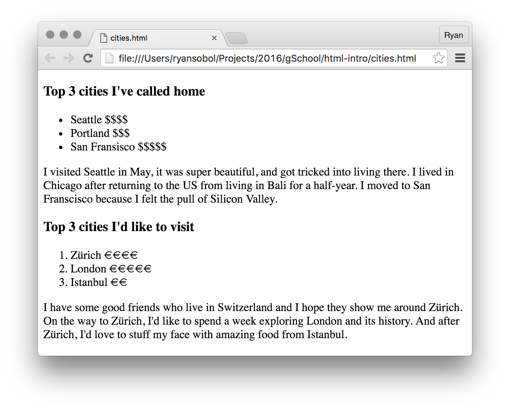

# HTML Introduction Exercise

0. Fork this repo and clone it to your computer.
   You can verify this by seeing your GitHub username in the URL and not `gschool`.

0. Create a new file named `cities.html`. Make sure it includes an [html](https://developer.mozilla.org/en-US/docs/Web/HTML/Element/html), [head](https://developer.mozilla.org/en-US/docs/Web/HTML/Element/head), and [body](https://developer.mozilla.org/en-US/docs/Web/HTML/Element/body). (then, commit your changes!)

0. Make an [unordered list](https://developer.mozilla.org/en-US/docs/Web/HTML/Element/ul) all of the cities you've lived in. (then, commit your changes!)

0. Make an [ordered list](https://developer.mozilla.org/en-US/docs/Web/HTML/Element/ol) of the top three cities you would like to visit. (then, commit your changes!)

0.  Add a [heading](https://developer.mozilla.org/en-US/docs/Web/HTML/Element/Heading_Elements) before each list that says what the list is. (then, commit your changes!)

0. Add a description under the items of each list explaining how you came to live in each of those cities, and why you would like to visit those cities respectively. (then, commit your changes!)

0. In the list of cities you've visited, add a [span](https://developer.mozilla.org/en-US/docs/Web/HTML/Element/span) at the end of each city with any [HTML character entity](https://developer.mozilla.org/en-US/docs/Glossary/Entity) and a short summary of why the city is on the list. (...then, commit your changes!)

## Stretch

* In the second list, make every odd number strong, and every even number emphasized. (then, commit your changes!)

* Add the following image somewhere in the page and give it a height and width attribute with number values: [Kitten Stack](http://i.giphy.com/fVMFiUwkZgpfG.gif). (then, commit your changes!)

* Style the page with CSS. (then, commit your changes!)

* Create a second page with additional content. (then, commit your changes!)

* Add videos and images of each city to the page. (then, commit your changes!)
